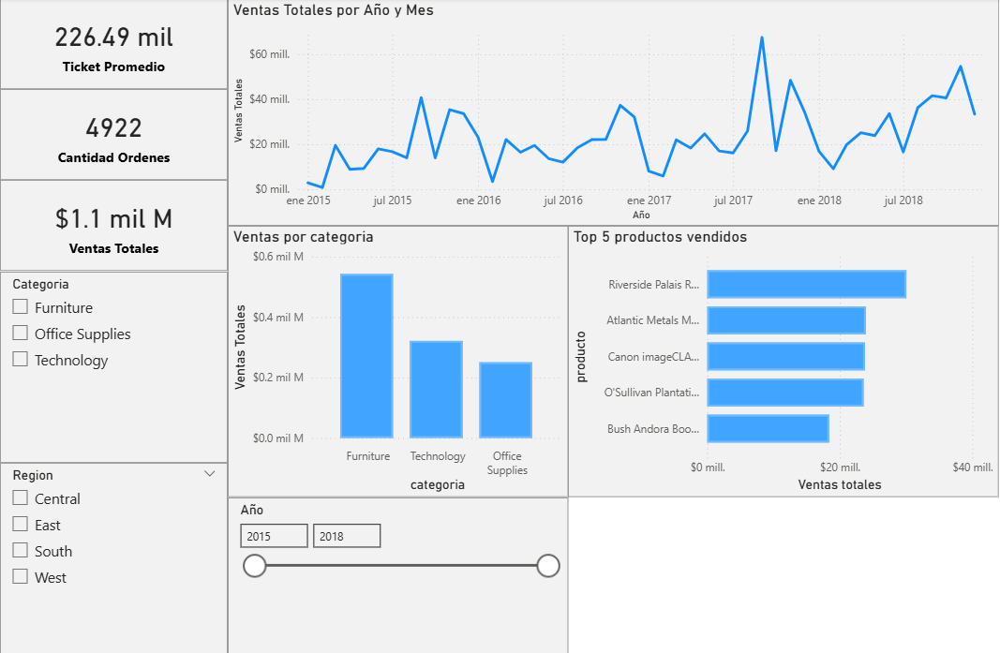

Dashboard de Ventas Retail – Power BI

Este proyecto consiste en el desarrollo de un dashboard interactivo para el análisis de ventas en un entorno retail.

🔧 Herramientas utilizadas
Power BI
Power Query (limpieza y transformación de datos)
DAX (medidas y KPIs)
📈 KPIs analizados
Ventas Totales
Ticket Promedio
Cantidad de Órdenes
📊 Análisis realizados
Evolución de ventas en el tiempo
Rendimiento por categoría
Top 5 productos más vendidos
🧠 Objetivo

Identificar tendencias de ventas y productos de mayor rendimiento para apoyar la toma de decisiones.

